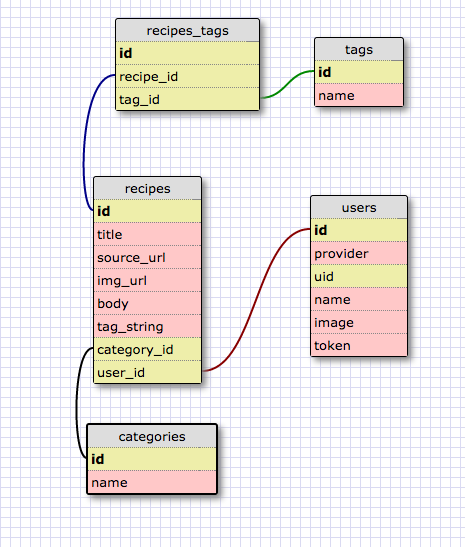

chefboard.

When finding recipes online, you normally have to either save the recipe link as a bookmark, or use another app with limited search functionality, effectively negating the purpose of saving it.
Chefboard allows you to create recipe pins on your own dashboard, and quickly search your pins based on the title and associated recipe tags.

With the available chrome extension, it is even easier to make a pin from a recipe site of your choice.
This makes returning to recipes easier, and more time efficient.

Visit chefboard and try it out yourself:
https://chefboard.herokuapp.com

Don't forget to get the chrome extension to maximize your chefboard experience!
https://chrome.google.com/webstore/detail/chefboard/ofhfgnaelacnnjjellgcecfeemfppljo/

How it works:

Right now, we start you out with some recipes to get you started. If you want to get rid of any of these,
 you can click on the image of a given recipe and select edit in the popup.
 This will allow you to either change some things about this recipe around, or to delete it entirely.

 To search around for pins, use the category filters on the side bar, and/or use the search bar on the top right. Type in
 any tags you think may be used, or ones you remember reference certain pins. This will dynamically filter the visible pins so that only those that match your search are displayed.

 Creating a new pin from the site itself, is easy, you just click the 'Add Recipe' button on the left side bar, and fill out the form with the necessary information. Making descriptive and concise tags will make it much easier to come back to a recipe later. With the chrome extension, new pins are even easier than on chefboard. All you do is go to the page that has the recipe you want to pin to chefboard, and click the icon for the chefboard extension. With the extension open, you will either be prompted to login (if not already done), or be presented with a series of pictures to choose from. Click the image you want saved with the pin, and the new pin form will auto populate the pin details for you. Now all you have to do is add tags, select a category and click 'Create Pin!' Then head on over to chefboard and check out your new pin! If you end up wanting to write more descriptive tags, change the category, or change anything else about your pin, you can always edit it later!

