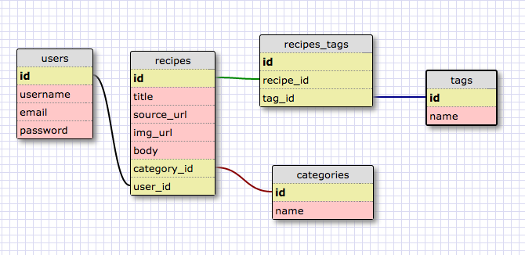

TRELLO BOARD

https://trello.com/b/oT3h7It4/chuckipies-2-0

TEAM AGREEMENTS
- We want to learn!
- We want to build something beuatiful and useful that we can be proud of.
- We will produce a product that is well done on all levels (from testing to front end).
- We will work during core hours.
- We will have a team planning meeting each morning.
- We will have quick team check-ins every 2 hours (11am, 2pm, 4pm, 6pm).
- We will stay focused and be very deliberate about how we plan our sprints amd manage our time.
- We will have amazing communication and raise any problems (technical or interpersonal) as soon as they arrise.

GIT WORKFLOW
- Work off of development fork, push MVP to master.
- Name branches ater features.
- Frequent, well named commits.
- Peer code reviews prior to merging.
- No one merges thier own code.

TESTS
- We will have great test coverage and be deliberate about out tests.
- We will use Simple Cov and write meaningful tests.
- We will use continuous integration.

TECH STACK
- Backend: Rails API
- Frontend: Angular
- Hosting platform: Heroku

NAME IDEAS
- Recepin
- Cookstarter
- Chuckipies 2.0
- Cutting Board

################################################################################
################################################################################
################################################################################
################################################################################

Nomenclature:

pin: save recipe to board
board: list of all recipes
category(basically a pinterest board): larger buckets (desserts, main courses etc.)
tag: custom labels (quick, healthy etc.)

User Stories:

1 - see a list of food items
1 - click a button/link to be taken to the recipes original source(in a new tab)
1 - user login/create account
1 - pin a new recipe while on my board
1 - remove a pin from my board
2 - see the food items by category (main dishes, desserts etc.)
2 - search recipes (via search bar by tag or title)
- click on an item and have it show me the full recipe
- get a recipe preview on the main page
- Fast, responsive
- easy to pin new recipe
- easy to tag a new recipe
- sorting by most recent, or rating, or alphabetical etc
- rating recipes
- login w/ facebook?
- view fbook friend's pins
- edit tags after the fact
- be able to manually input the recipe information
- save(pin) recipe from external website
- see a list if all pins
- have a recommended recipes section underneath the users collections

Associations:

Category (1) : Recipes(M)
Recipes(M) : Tags(M)
User(1) : Recipes(M)

